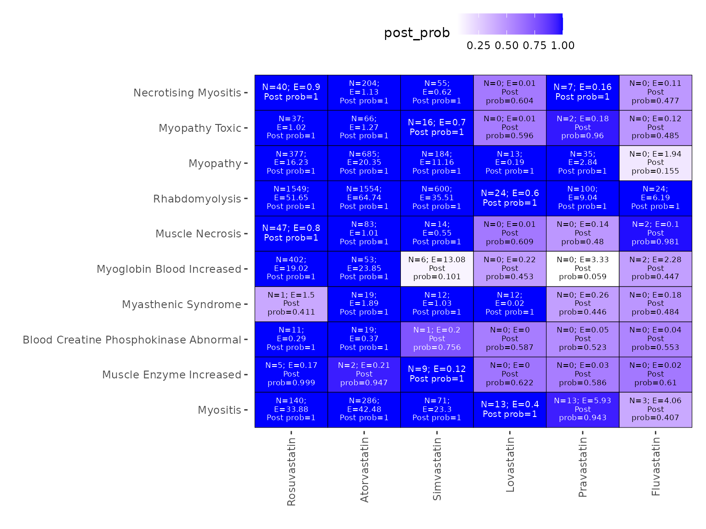
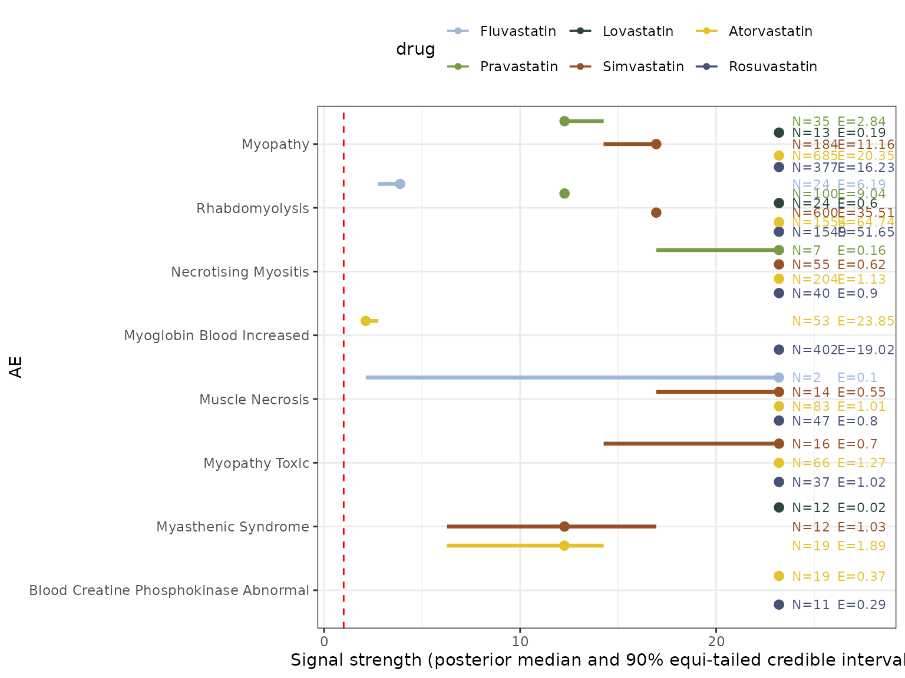

# Analyzing SRS frequency table with pvEBayes

### Disproportionality Analysis

Contemporary drug postmarketing surveillance largely relies on the
collection of spontaneous reports of suspected adverse drug events from
pharmaceutical companies, healthcare professionals, and patients. These
reports are curated and stored in spontaneous reporting systems (SRS),
usually organized as a large frequency table for downstream data
analysis. We consider an SRS dataset cataloging AE reports on $I$ AE
rows across $J$ drug columns. Let $N_{ij}$ denote the number of reported
cases for the $i$-th AE and the $j$-th drug, where $i = 1,...,I$ and
$j = 1,...,J$. Therefore, AE-drug pairwise occurrences from the
AE-reports are summarized into an $I \times J$ contingency table, where
the $(i,j)$-th cell catalogs the observed count $N_{ij}$ indicating the
number of cases involving $i$-th AE and the $j$-th drug.

Methods implemented in this package assumes the observed count $N_{ij}$
conditional on $E_{ij}$ is that
$$N_{ij} \mid E_{ij} \sim \operatorname{Poisson}\left( E_{ij}\lambda_{ij} \right),$$
where the parameter $\lambda_{ij} \geq 0$ is the relative reporting
ratio, the signal strength, for the $(i,j)$-th pair measuring the ratio
of the actual expected count arising due to dependence to the null
baseline expected count. Therefore, $\{\lambda_{ij}\}$ are our key
parameters of interest. A large $\lambda_{ij}$ indicates a strong
association between a drug and an AE.

Let $g$ be a prior density function for signal strength parameters for
all AE-drug pairs: $\lambda_{ij} \sim g$. Then, in the context of the
Poisson model, the marginal probability mass function of $N_{ij}$ is
given by:
$$p\left( N_{ij} \right) = \int_{0}^{\infty}g\left( \lambda_{ij} \right)\ f_{\text{pois}}\left( N_{ij} \mid \lambda_{ij}E_{ij} \right)\ d\lambda_{ij},$$
where $f_{\text{pois}}(N \mid \lambda)$ is the probability mass function
of a Poisson random variable with mean $\lambda$ evaluated at $N$. Under
the empirical Bayes framework, the prior distribution is consequently
estimated from the data by maximizing the log marginal likelihood:
$$\widehat{g} = \operatorname{argmax}\limits_{g}\sum\limits_{i = 1}^{I}\sum\limits_{j = 1}^{J}\log p\left( N_{ij} \right).$$
Then, the estimated posterior density of $\lambda$ given $N_{ij}$ is:
$$\widehat{\text{p}}\left( \lambda \mid N_{ij} \right) = \frac{\widehat{g}(\lambda)f_{\text{pois}}\left( N_{ij} \mid \lambda E_{ij} \right)}{\widehat{\text{p}}\left( N_{ij} \right)},$$
where
$\widehat{\text{p}}\left( N_{ij} \right) = \int_{0}^{\infty}\widehat{g}\left( \lambda_{ij} \right)f_{\text{pois}}\left( N_{ij} \mid \lambda_{ij}E_{ij} \right)\ d\lambda_{ij}$.

All empirical Bayes models implemented in ‘pvEBayes’ share the structure
described above; they differ in their assumptions on the prior
distribution. The Gamma-Poisson Shrinker (GPS) adopts a two-component
gamma mixture prior. The K-gamma model generalizes GPS by allowing a
K-component gamma mixture, where K is user-specified. The Koenker-Mizera
(KM) and Efron models use a nonparametric discrete mixture prior, with
point masses on a pre-specified grid. The general-gamma model employs a
nonparametric sparse gamma mixture distribution.

Package ‘pvEBayes’ provides implementations for the empirical Bayes
methods for pharmacovigilance mentioned above. It provides tools for
effectively fitting these models to the spontaneous reporting system
(SRS) frequency tables, extracting summaries, performing hyperparameter
tuning, and generating graphical summaries (eye plots and heatmaps) for
signal detection and estimation. In the following we provide an example
(borrowed from Tan et al.) of SRS data analyzing with ‘pvEBayes’.

### Analyzing FDA statin SRS data with pvEBayes

``` r
library(pvEBayes)
library(ggplot2)
# load the SRS data
data("statin2025_44")

# show the first 6 rows
head(statin2025_44)
#>                                        Atorvastatin Fluvastatin Lovastatin
#> ACUTE KIDNEY INJURY                            1132          23         23
#> ANURIA                                           46           0          0
#> BLOOD CALCIUM DECREASED                          51           2          0
#> BLOOD CREATINE PHOSPHOKINASE ABNORMAL            19           0          0
#> BLOOD CREATINE PHOSPHOKINASE INCREASED          624          21          4
#> BLOOD CREATININE ABNORMAL                        11           0          0
#>                                        Pravastatin Rosuvastatin Simvastatin
#> ACUTE KIDNEY INJURY                            153         1141         453
#> ANURIA                                           1           56          29
#> BLOOD CALCIUM DECREASED                          3          877           6
#> BLOOD CREATINE PHOSPHOKINASE ABNORMAL            0           11           1
#> BLOOD CREATINE PHOSPHOKINASE INCREASED          41          557         216
#> BLOOD CREATININE ABNORMAL                        0           32           6
#>                                        Other_drugs
#> ACUTE KIDNEY INJURY                         192114
#> ANURIA                                        7079
#> BLOOD CALCIUM DECREASED                      33175
#> BLOOD CREATINE PHOSPHOKINASE ABNORMAL          133
#> BLOOD CREATINE PHOSPHOKINASE INCREASED       17203
#> BLOOD CREATININE ABNORMAL                     2645
```

#### Fit the general-gamma model

Our interest lies in finding the most important adverse events and
estimating the corresponding signal strength of these 6 statin drugs.
These are achieved by fitting empirical Bayes models with pvEBayes() to
the SRS data. We begin by fitting the general-gamma model to this
dataset. Other models mentioned above could be used by modifying the
‘model’ argument. For illustration, we fit the model with a fixed
hyperparameter value of \$ = 0.5\$ using the pvEBayes() function.

``` r

gg_given_alpha <-  pvEBayes(statin2025_44,
 model = "general-gamma",
 alpha = 0.5
 )

 gg_given_alpha_detected_signal <- summary(gg_given_alpha,
 return = "detected signal"
 )
 sum(gg_given_alpha_detected_signal)
#> [1] 105
```

The return argument specifies which component the summary function
should return. Valid options include: “prior parameters”, “likelihood”,
“detected signal”, and “posterior draws”. If it is set to NULL
(default), all components will be returned in a list. In this example,
we show the detected signals.

In this package, we suggest tuning the general-gamma model by AIC or
BIC, which can be accessed through ‘AIC()’ or ‘BIC()’ functions, as
shown below:

``` r

AIC(gg_given_alpha)
#> [1] 3802.753

BIC(gg_given_alpha)
#> [1] 4016.649
```

In practice, one can specify a list of candidate $\alpha$ values, fit
the general-gamma model for each, compute the corresponding AIC or BIC,
and select the model with the lowest AIC or BIC. Instead of manually
doing so, one can use the ‘pvEBayes_tune()’ function, which implements
these steps. The relevant code is given below:

``` r

gg_tune_statin44 <- pvEBayes_tune(statin2025_44,
 model = "general-gamma",
 alpha_vec = c(0, 0.1, 0.3, 0.5, 0.7, 0.9),
 use_AIC = TRUE
 )
#> The alpha value selected under AIC is 0.3,
#> The alpha value selected under BIC is 0.1.
#>   alpha      AIC      BIC num_mixture
#> 1   0.0 4551.612 4697.962          13
#> 2   0.1 3799.011 3990.392          17
#> 3   0.3 3798.874 4001.513          18
#> 4   0.5 3802.753 4016.649          19
#> 5   0.7 3822.367 4081.295          23
#> 6   0.9 3906.526 4323.061          37
```

### Visualization

In addition, ‘pvEBayes’ has implemented visual summary methods for both
signal detection and estimation, which are heatmap and eyeplot. These
plot functions can be accessed through the ‘plot()’ with argument type =
“heatmap” or type = “eyeplot”.

``` r

heatmap_gg_tune_statin44 <- plot(gg_tune_statin44,
 type = "heatmap",
 num_top_AEs = 10,
 cutoff_signal = 1.001
 )

heatmap_gg_tune_statin44 +
 theme(
   legend.position = "top"
 )
```



The above heatmap visualizes the signal detection result for the fitted
general-gamma model. For each AE-drug combination, the number of reports
(N), the estimated null value (E), and the estimated posterior
probability of being a signal are given. A deeper blue color indicates
stronger evidence for a signal.

``` r

eyeplot_gg_tune_statin44 <- plot(gg_tune_statin44,
 type = "eyeplot",
 num_top_AEs = 8,
 N_threshold = 1,
 log_scale = FALSE,
 text_shift = 2.3,
 text_size = 3,
 x_lim_scalar = 1.2
 ) 

eyeplot_gg_tune_statin44 +
 theme(
   legend.position = "top"
 )
```



The above eyeplot visualizes empirical posterior inferences on 10
prominent AEs across 6 statin drugs through computed empirical Bayesian
posterior distributions of signal strengths $\{\lambda_{ij}\}$ obtained
from the general-gamma model fitted on the statin2025_44 dataset. The
points and bars represent the posterior medians and 90% equi-tailed
credible intervals for the corresponding AE-drug pair specific
$\{\lambda_{ij}\}$, with different colors indicating the results from
different statin drugs. The red dotted vertical line represents the
value ‘1’. The texts on the right provide the number of observations as
well as the null baseline expected counts under independence for an
AE-drug pair.

## References

Tan Y, Markatou M and Chakraborty S. Flexible Empirical Bayesian
Approaches to Pharmacovigilance for Simultaneous Signal Detection and
Signal Strength Estimation in Spontaneous Reporting Systems Data.
*Statistics in Medicine*. 2025; 44: 18-19,
<https://doi.org/10.1002/sim.70195>.

Tan Y, Markatou M and Chakraborty S. pvEBayes: An R Package for
Empirical Bayes Methods in Pharmacovigilance. *arXiv*:2512.01057
(stat.AP). <https://doi.org/10.48550/arXiv.2512.01057>

Koenker R, Mizera I. Convex Optimization, Shape Constraints, Compound
Decisions, and Empirical Bayes Rules. *Journal of the American
Statistical Association* 2014; 109(506): 674–685,
<https://doi.org/10.1080/01621459.2013.869224>

Efron B. Empirical Bayes Deconvolution Estimates. *Biometrika* 2016;
103(1); 1-20, <https://doi.org/10.1093/biomet/asv068>

DuMouchel W. Bayesian data mining in large frequency tables, with an
application to the FDA spontaneous reporting system. *The American
Statistician*. 1999; 1;53(3):177-90.
